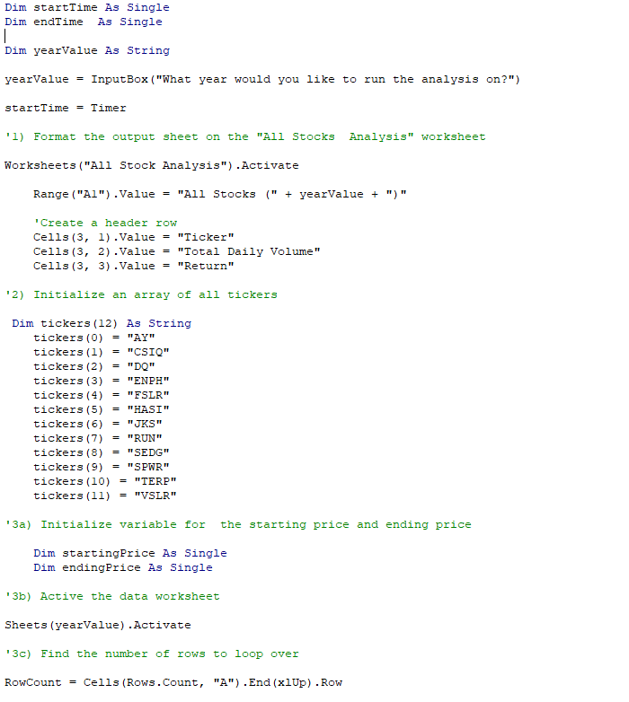
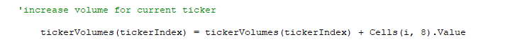
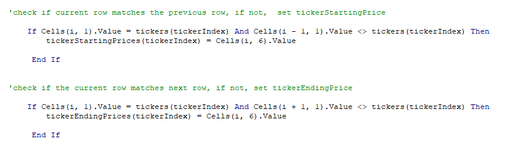

# Stock Analysis

## Purpose

This analysis is meant to take data from the last several years of the stock market, focusing on 12 specific stocks. Using the written code, each stocks' total daily trade volume and over all annual return can be caluculated by putting in the year in question. The code was originally written but to make it run more effeciently, a refactored version of the script was generated.

## Results

### Analysis

I started by pulling the output sheet set up code and ticker array from Sub AllStockAnalysis as shown here:

I then created a tickerIndex, setting it to zero. Ticker volumes were calculated by checking rows for tickerIndexes and increasing the volume each time a tickerIndex was found:

Starting prices and ending prices were found using If statements checking to see the first time a tickerIndex appeared by checking against the row above it and pulling the price. Ending prices were identified by checking to see if tickerIndex for the row below matched. These values are then used to calculate the percentage of return on the stock for the indicated year.

### Results

The results are color coded to show positive or negative returns at a glance in red or green. Stocks ENPH and RUN were the only two stocks to show positive returns in both years of 2017 and 2018.

##Summary

### Pros and Cons of Refactoring

### Pros and Cons of original vs reactored VBA script
